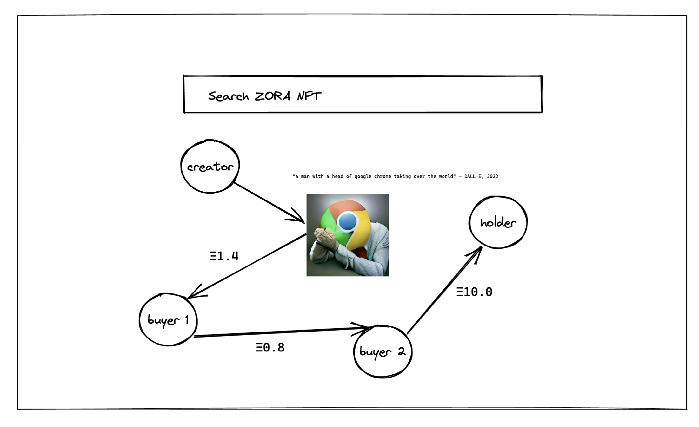

# 🕸️ Indra's net for zNFTs

This is a SPA that you can search and select the znft you would like to see connections with. Currently supported transaction types (events):

- `Mint`
- `Transfer`
- `Sales`

More design TBD

## Example NFTs for transaction history

- only mint and transfers: `/collections/0x1d963688fe2209a98db35c67a041524822cf04ff/49460`
- more complex mint, transfers: `/collections/0xbc4ca0eda7647a8ab7c2061c2e118a18a936f13d/4070`
- nouns: `/collections/0x9C8fF314C9Bc7F6e59A9d9225Fb22946427eDC03/296`

## TODOs

- This repo is currently only compatible with `react@17` due to limitations of @ourzora/nft-components version. This will need to be updated at a later stage.
- Upgrade to Next.js app router
- Zora's nft libraries is out of maintenance for over 2 years now, and this no long works as they turned on their CF ACL to block CORS requests (Error 1014), so next will be:
  - come up with a in-house NFT component strategy with proper data fetching
    - you can check out the new restful api here: https://explorer.zora.energy/api-docs
  - or migrate over [nouns](https://github.com/nounsDAO/nouns-monorepo/tree/master/packages/nouns-sdk) sdk so that it has more up-to-date fetching strategy
  - and lastly deprecate all external libraries except basic eth standardized operations functions
